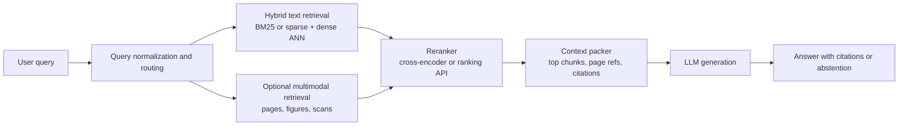
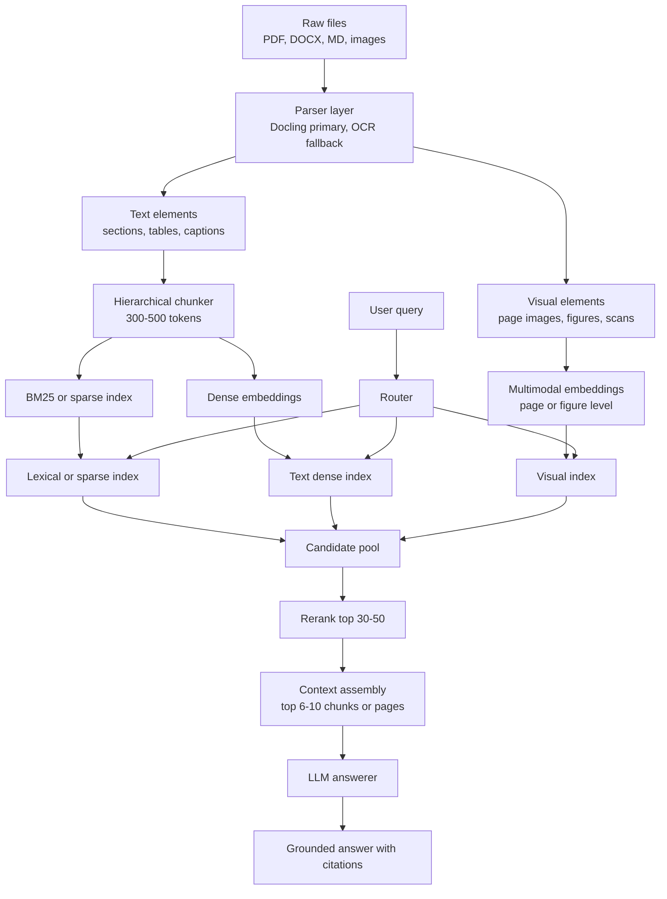

# RAG Implementation State of the Art in April 2026

## Executive summary

The primary purpose of Retrieval-Augmented Generation is still the same in April 2026: ground an LLM’s answer in external, updatable evidence so the system can be more factual, fresher, and more auditable than a model answering from parameters alone. In production systems, RAG is less about “adding a vector database” than about building a retrieval stack that can consistently find the right evidence fast, cheaply, and with enough provenance to let the generator cite and abstain when needed. The original RAG formulation framed this as combining parametric memory with non-parametric memory, and the major platform vendors now express the same goal in more practical terms: grounding, freshness, and reduced hallucination. citeturn20search0turn34view0turn35view0

The de facto production pattern in 2026 is **retrieve-then-generate with hybrid retrieval and second-stage reranking**. This is not just a theoretical preference; it is the pattern most directly supported across the major ecosystems: Azure AI Search recommends hybrid queries plus semantic ranking for classic RAG, Vertex AI supports vector, full-text, semantic, and hybrid retrieval plus a dedicated ranking API, Pinecone exposes semantic, lexical, hybrid, and rerank primitives, Milvus documents dense+sparse hybrid retrieval, Elastic’s quickstarts use hybrid search, and BGE-M3’s own model card recommends hybrid retrieval plus reranking. That makes the most common deployment architecture an inference from platform support: **BM25 or learned sparse + dense embeddings + top-k reranker + LLM generation**. citeturn34view0turn35view3turn31view0turn32view1turn23search12turn28view0

For your use case—**natural-language search over a large corpus of PDFs, Word files, Markdown, and images, to support an LLM**—the highest-confidence recommendation is a **hybrid dual-index design**. Use a **text-first pipeline** for the majority of queries, built on robust document parsing, hierarchical chunking, metadata-rich indexing, dense+sparse retrieval, and cross-encoder reranking. Add a **multimodal page/image index** for visually rich pages, scanned PDFs, charts, tables, and diagrams. In practice, that means one of two best-fit stacks:  
an **open stack** centered on Docling or Unstructured for parsing, a framework like LangChain/LlamaIndex/Haystack for orchestration, and Milvus/Weaviate/OpenSearch or Elastic for retrieval; or a **managed stack** centered on Azure AI Search or Vertex AI RAG Engine if you want faster time to production and integrated OCR/vectorization. citeturn16search3turn17search5turn3search0turn4search2turn1search2turn32view0turn30view3turn33view0turn34view0turn35view0

If your corpus is mostly text with some figures, the right default is **hybrid retrieve-then-generate**. If your corpus is rich in scanned pages, tables, charts, and layout-sensitive material, add **multimodal embeddings or late-interaction visual retrieval** for pages and figures rather than relying only on OCR. Current evidence from ColPali/ViDoRe-style research, Jina Embeddings v4, Weaviate’s multimodal guidance, OpenSearch multimodal search, and Gemini Embedding 2 all points the same way: visual retrieval is now practical and materially useful for document-heavy corpora, but it is still more memory- and latency-expensive than text-first RAG, so it should be deployed selectively unless your corpus is heavily visual. citeturn19search2turn27search1turn28view1turn30view3turn33view1turn28view2

## Architectural patterns

The classic architectural families are still useful, but their production roles have diverged.

### Retriever–reader

The retriever–reader pattern comes from open-domain QA: a retriever pulls candidate passages, then a reader extracts or synthesizes the answer from those passages. Dense Passage Retrieval is the canonical modern reference point, and it showed that better retrieval precision materially improves downstream QA. This architecture remains useful whenever you want retrieval and answer extraction to be separable and measurable, especially in evaluation and high-control systems. In enterprise LLM applications, the “reader” is often just your answering LLM plus a citation template, but the design logic is the same. citeturn20search2turn20search0

### Retrieve-then-generate

Retrieve-then-generate is the canonical enterprise RAG architecture in 2026. The application issues one or more searches, gathers evidence, optionally reranks or compresses it, then passes a bounded context package to the generator. LangChain’s own docs present both a fast 2-step RAG chain and an agentic RAG variant; Azure contrasts classic single-query RAG with its newer agentic retrieval; Vertex AI RAG Engine expresses the pipeline as ingestion, transformation, embedding, indexing, retrieval, and generation. This architecture wins in practice because it keeps retrieval replaceable, lets you update knowledge without retraining, and allows cost/latency tuning independently of the generator. citeturn3search0turn3search4turn34view0turn35view0

### Fusion-in-decoder

Fusion-in-Decoder remains important academically and sometimes in specialized high-accuracy QA, but it is not the mainstream enterprise deployment default. FiD jointly reasons over many retrieved passages by encoding each passage separately and fusing them in the decoder, which can improve multi-evidence answer quality. The drawback is compute: later work notes that much of FiD inference time is spent in the decoder, and reduced-compute FiD variants explicitly target that bottleneck. In other words, FiD is still relevant when you are optimizing for benchmark-style answer quality over a fixed retrieval setting, but it is usually too expensive and operationally inflexible for broad document search products. citeturn21search0turn20search5turn21search3

### RAG-as-a-service

RAG-as-a-service means managed ingestion, indexing, retrieval, and often reranking or answer orchestration. The cleanest examples today are Azure AI Search’s agentic retrieval, Vertex AI RAG Engine, and Pinecone’s assistant/integrated inference surface. The value proposition is faster deployment, lower ops burden, and built-in connectors or vectorization. The cost is less control over parsing semantics, ranking strategy, migration timing, and infrastructure lock-in. This model is strongest when your bottleneck is platform engineering time, not raw infrastructure cost. citeturn34view0turn35view0turn35view4turn31view1turn31view2

The following diagram reflects the architectural center of gravity in 2026: hybrid retrieval, reranking, optional multimodal branch, then generation.

That diagram mirrors what the large platforms expose directly: hybrid search, multimodal retrieval, and reranking as explicit building blocks, with agentic query planning emerging as an optional front-end rather than the new default for every query. citeturn34view0turn35view3turn33view0turn33view1turn30view2turn35view2

### What is emerging

Several strategies are genuinely advancing the state of the art, but they are not all equally production-ready.

**Agentic retrieval and query decomposition** are moving from novelty to feature. Azure’s agentic retrieval uses LLM-assisted query planning and parallel subqueries; LangChain supports agentic RAG; LlamaIndex offers router retrievers; Haystack documents query decomposition and hierarchical retrieval; NVIDIA’s RAG Blueprint explicitly exposes query decomposition for multi-hop questions. This is useful for hard queries, but it adds latency, failure modes, and eval complexity. It should usually be an escalation path, not the universal first pass. citeturn34view0turn3search0turn4search5turn1search7turn24search17

**Contextual retrieval** is one of the most important practical retrieval advances since plain hybrid search. Anthropic’s Contextual Retrieval combines Contextual Embeddings and Contextual BM25 and reports fewer failed retrievals, especially when paired with reranking. Conceptually, it addresses a real production weakness: chunking often strips away local context that matters for retrieval. This technique is strong when chunk meaning depends on surrounding document structure. citeturn36view0turn24search0

**Retrieval-augmented fine-tuning** is real, but still selective. RAFT trains a model to use retrieved evidence well and ignore distractors, which can outperform naïve prompt-only RAG in domain settings. This matters when you have stable domain data, can curate supervised examples, and need better evidence use rather than only better retrieval. It is not a replacement for retrieval; it is an optimization on top of it. citeturn19search1turn19search5

**Multimodal late-interaction retrieval** is the big shift for document corpora. ColPali and follow-on systems reframed visually rich document retrieval as page-image retrieval rather than only OCR-plus-text retrieval. Weaviate, OpenSearch, and Jina all now expose multi-vector or multimodal retrieval routes that align with that direction. This is especially relevant to PDFs with charts, tables, diagrams, forms, and layout-heavy pages. citeturn19search2turn27search3turn30view1turn33view1turn28view1

**On-device RAG** is becoming viable for constrained deployments. Google’s EmbeddingGemma is explicitly positioned for on-device embeddings, and Jina provides GGUF and llama.cpp paths for multimodal embeddings. This is promising for private or edge retrieval, but enterprise-scale mixed-document search still usually belongs on server infrastructure. citeturn25search6turn25search4

**Privacy-preserving federated retrieval** is emerging, but not mature enough to recommend as a default architecture for your use case. The 2025 federated RAG literature shows growing interest, especially for sensitive multi-silo deployments, but the ecosystem is still early and evaluation standards remain unsettled. Treat it as a future option if your documents are split across organizations or regulated data silos. citeturn19search3turn19search11turn25search2

## Retrieval and ingestion design

### Retrieval methods and their tradeoffs

**Sparse retrieval** remains indispensable. BM25 is still the most robust cheap baseline, especially for exact terms, IDs, product codes, legal citations, filenames, error messages, and wording-sensitive queries. Learned sparse retrieval is becoming more practical too: OpenSearch exposes neural sparse search, Milvus supports sparse vectors such as SPLADE and BGE-M3-style sparse outputs, and BGE-M3 itself is designed to support sparse, dense, and multi-vector retrieval from one model family. Sparse retrieval usually has the best throughput and lowest incremental serving cost because it runs well on commodity CPU search engines. citeturn33view3turn32view0turn28view0turn18search19

**Dense embeddings** remain the standard semantic layer. They are strong on paraphrase, conceptual similarity, and cross-lingual matching, and they are the workhorse for semantic retrieval across every major RAG platform. Their weaknesses are well known: they can miss rare exact strings, blur distinct near-neighbors, and flatten structure in tables and layouts. Dense retrieval is usually the best single retrieval mode if you can only choose one, but it is rarely the best final production mode for heterogeneous enterprise corpora. citeturn20search0turn31view0turn35view3

**Hybrid retrieval** is the most-used production choice for a reason: it pairs lexical precision with semantic recall. Azure explicitly recommends hybrid queries for maximum recall in RAG, Vertex Vector Search 2.0 supports hybrid search, Pinecone, OpenSearch, Elastic, Milvus, and Weaviate all expose hybrid or multi-path search, and BGE-M3’s own guidance recommends hybrid retrieval plus reranking. The downside is modestly higher retrieval complexity and a small latency bump from parallel or fused searches, but the quality gain is usually worth it. citeturn34view0turn35view3turn31view0turn33view0turn23search4turn32view1turn28view0

**Cross-encoders and semantic rerankers** are now table stakes for high-quality RAG. Weaviate describes reranking as a second-stage relevance step over a smaller candidate set, Vertex AI exposes a dedicated ranking API with sub-100 ms latency claims, Elastic offers Elastic Rerank, OpenSearch provides cross-encoder reranking pipelines, and Cohere exposes quality/latency tiers in its rerank family. The tradeoff is straightforward: reranking is more expensive per candidate than first-stage retrieval, so you use it on the top 20–100 candidates, not the full corpus. citeturn30view2turn35view2turn23search15turn33view2turn28view3

**Late-interaction and multi-vector retrieval** are increasingly important for harder corpora. Weaviate’s multi-vector support, OpenSearch’s late-interaction reranking support, and Jina Embeddings v4’s single-vector plus multi-vector modes all reflect the same trend: token- or patch-level interaction improves relevance over complex text and visual documents, but it increases memory use and query cost. This should be used where the corpus actually benefits—visually rich PDFs, tables, diagrams, forms, slide decks—not as the universal default for plain prose. citeturn30view1turn26search6turn28view1

### Parsing, chunking, and metadata

For mixed documents, **parsing quality is often more important than the choice between two good embedding models**. Docling is notable because it aims specifically at AI-ready structured extraction across PDF, DOCX, PPTX, HTML, images, and more, with layout, reading order, tables, formulas, and OCR in a unified representation. Unstructured provides a similar “document elements + metadata” model with partitioning, chunking, and extraction APIs. Recent 2026 research comparing document conversion frameworks found that hierarchy-aware splitting and image descriptions mattered more to downstream QA accuracy than the conversion framework alone, though Docling performed strongly in that comparison. citeturn16search3turn16search2turn17search5turn17search1turn16academia12

For chunking, the current best practice is **hierarchical, structure-aware chunking**, not blind fixed windows. Azure’s Document Layout guidance explicitly recommends structure-based chunking around headings, paragraphs, and semantic coherence. Vertex AI RAG Engine defaults to 1,024-token chunks with 256-token overlap, which is a sane managed baseline. LlamaIndex exposes ingestion pipelines with caching and document management, and Haystack documents sentence-window, auto-merging, HyDE, query expansion, and hierarchical retrieval options. The pattern is clear: use structure first, then tune token windows only after evaluating retrieval failure cases. citeturn34view4turn35view1turn4search2turn4search6turn1search5turn1search7

For your corpus, the best default is:

- **Section-aware text chunks** of roughly **300–500 tokens** for prose, with **10–15% overlap**.
- **Preserved heading path** in metadata.
- **Page number, bounding box, and source file IDs** on every chunk.
- **Tables stored twice**: raw structured form such as HTML/JSON and a concise retrieval summary.
- **Images/pages stored as first-class objects** when a page has charts, figures, tables, stamps, handwriting, or weak OCR.
- **ACL and tenancy metadata** attached at document and chunk level.

Those parameters are not vendor defaults; they are the most defensible starting point for mixed enterprise documents because they keep chunks semantically coherent while preserving positional provenance. They should still be validated with recall@k and grounded-answer testing on your own queries. Azure and Vertex both reinforce the need for chunking under embedding token limits, while Anthropic’s contextual retrieval work is a reminder that too-aggressive chunking loses retrieval-critical context. citeturn34view2turn35view1turn36view0

### Embedding model choices

The closed-model landscape is now broad enough that model choice should be driven by **modality, latency budget, and deployment constraints**, not just leaderboard reputation.

For **text-first retrieval**, strong current choices include entity["company","OpenAI","ai company"]’s `text-embedding-3-large`, which defaults to 3,072 dimensions and supports dimension shortening; entity["company","Voyage AI","embedding model company"]’s voyage-4 / voyage-4-lite family, which offers 1,024-dimensional defaults with adjustable output size and explicit retrieval-oriented `input_type`; and entity["company","Cohere","ai company"]’s `embed-v4.0`, which supports dimensions from 256 to 1,536 and mixed text/image inputs. If you want strongest multilingual and code-friendly retrieval while keeping dimensions tractable, Voyage and OpenAI are especially practical. If you want one closed model that can span text, images, and PDFs, Cohere Embed v4 is unusually flexible. citeturn29view0turn29view1turn28view3

For **multimodal retrieval**, entity["company","Google","technology company"]’s Gemini Embedding 2, entity["company","Jina AI","search ai company"]’s Jina Embeddings v4, and Weaviate’s visual-document models are the most notable current options. Gemini Embedding 2 takes images, text, documents, audio, and video and produces a unified 3,072-dimensional space. Jina Embeddings v4 is explicitly aimed at complex document retrieval, with 2,048-dimensional single-vector outputs and 128-dimensional per-token late-interaction outputs. Weaviate’s `ModernVBERT/colmodernvbert` is purpose-built for visual document retrieval without heavy OCR pipelines and recommends MUVERA encoding to reduce the memory hit of multi-vector search. citeturn28view2turn28view1turn30view3turn30view1

For **open or self-hosted retrieval**, BGE-M3 is still one of the most strategically useful choices because it spans dense, sparse, and multi-vector retrieval in one model family and explicitly recommends hybrid retrieval plus reranking. For edge or on-device use, EmbeddingGemma and Jina’s GGUF paths are worth watching, but for a large mixed-document corpus they are better seen as deployment-specific options than the general best choice. citeturn28view0turn25search6turn25search4

### Vector stores, ANN, compression, and updates

On vector databases, the big architectural divide is between **vector-first systems** and **search-first systems with vector capability**.

Vector-first systems such as Milvus, Weaviate, and Pinecone are usually easier when you want multimodal support, named vectors, or high-scale ANN without bringing in a full search platform. Milvus documents dense, sparse, full-text, hybrid search, and multiple reranking schemes in one system; Weaviate supports named vectors, multi-target search, multi-vector encoding, and integrated rerankers; Pinecone emphasizes semantic, lexical, hybrid, metadata filtering, reranking, and integrated inference over a managed API. These are strong fits if vector retrieval is the core capability and you do not need the full search engine surface of Elastic/OpenSearch. citeturn32view0turn32view2turn30view0turn30view2turn31view0turn31view1

Search-first systems such as OpenSearch and Elastic are often better when you need **strong metadata filtering, mature lexical search, operational familiarity, and a richer search DSL**. OpenSearch now supports semantic, hybrid, multimodal, and neural sparse search, with automated workflows for setting up ingest and search pipelines. Elastic’s current guidance and `semantic_text` stack lean heavily into hybrid search, chunking customization, and semantic reranking. If your workload looks as much like enterprise search as LLM retrieval, these systems are often the safest long-term choice. citeturn33view3turn33view0turn33view1turn23search3turn23search4turn23search15

For ANN index choice, **HNSW is the default first pick** for low-latency interactive retrieval, while **IVF-PQ or other compressed indexes** become attractive when memory pressure dominates. Milvus’s index docs summarize the tradeoffs well: graph indexes like HNSW excel at low-latency search, while PQ and related quantization reduce memory at some recall cost. Weaviate similarly emphasizes compression for multi-vector systems. For your interactive target, start with HNSW-like settings for the text index, then add PQ or other quantization only when you have measured memory or QPS pain. citeturn32view3turn30view1

For updates, prefer **incremental, hash-based ingestion**. LlamaIndex’s document management pipeline is explicit about using document IDs and hashes to skip unchanged items and reprocess changed ones. Azure integrated vectorization and indexers can push source changes through cracking, chunking, vectorization, and indexing. Pinecone notes eventual consistency, which matters operationally if your system promises immediate freshness. Your pipeline should therefore track document version, stable chunk IDs, and ingestion lag explicitly. citeturn4search6turn34view1turn31view3

## Toolchain landscape

On the orchestration side, the open-source leaders still occupy distinct roles.

entity["company","LangChain","ai framework company"] is strongest when you want broad ecosystem reach, quick prototyping, and explicit support for both 2-step RAG chains and agentic RAG. Its retrieval surface includes contextual compression, multi-query retrieval, parent/child retrieval, and multi-vector retrieval, which makes it a good application-layer choice when you expect retrieval logic to evolve. citeturn3search0turn3search2turn24search2turn24search16

entity["company","LlamaIndex","data framework company"] is strongest when you want **ingestion and retrieval as first-class abstractions**. Its ingestion pipeline, vector store integrations, router retrievers, ensemble retrieval, and multimodal retrieval guidance make it especially well suited to document-heavy systems where parsing, indexing, and query routing matter as much as prompt orchestration. citeturn4search2turn4search5turn4search4turn4search8turn3search3

entity["company","deepset","ai search company"]’s Haystack remains attractive for modular, inspectable pipelines and evaluation-oriented engineering. Its component graph, document stores, sentence-window retrieval, and advanced-RAG cookbook material make it a strong choice when you want explicit DAG-style retrieval pipelines rather than chain abstractions. citeturn1search2turn1search1turn1search5turn1search7

On the data-store side, the strongest open-source-centered options for your workload are Milvus, Weaviate, OpenSearch, and Elastic. Milvus is particularly good when you want dense+sparse hybrid retrieval and explicit ANN/compression tuning. Weaviate is especially compelling if you anticipate named vectors, multimodal search, and integrated rerankers. OpenSearch and Elastic are best when you want enterprise search ergonomics, strong filters, and hybrid retrieval in a familiar search stack. citeturn32view0turn32view1turn30view0turn30view2turn33view0turn23search12

Among managed platforms, entity["company","Microsoft","software vendor"] Azure AI Search and entity["company","Google","technology company"] Vertex AI RAG Engine are the most complete “documents to grounded answer” offerings in this research set. Azure is especially strong on integrated document cracking, OCR, chunking, integrated vectorization, hybrid search, and semantic ranking, with agentic retrieval emerging as the new preferred path for complex conversational retrieval. Vertex AI RAG Engine provides managed ingestion, connectors, configurable chunking, reranking, and a serverless path backed by managed vector search. citeturn34view0turn34view1turn34view3turn34view5turn35view0turn35view1turn35view2turn35view4turn35view5

entity["company","Pinecone","vector db company"] remains a strong managed vector-first option when you want excellent API UX and database/inference separation without adopting a cloud vendor’s full application platform. It now exposes hosted embeddings and rerankers as integrated inference primitives and supports lexical, semantic, hybrid, and metadata-filtered search. The tradeoff is that parsing and document understanding are still more externalized than in Azure or Vertex managed flows. citeturn31view0turn31view1turn31view2

With entity["company","Anthropic","ai company"] and Claude, the important nuance is that the company offers **powerful RAG building blocks**, but not the same full-stack managed retriever surface that Azure or Vertex do. Anthropic’s current strengths are Contextual Retrieval guidance, prompt caching for large stable prefixes, the Files API for create-once/use-many file handling, and MCP for connecting Claude to external tools and data sources. For a Claude-based system, the recommended production shape is still “external retriever + Claude for reasoning and answer synthesis,” not “Claude as your entire retrieval platform.” citeturn36view0turn36view1turn36view2turn36view3

## Evaluation and failure modes

Evaluation in 2026 is best done in **three layers**: retrieval quality, end-to-end answer quality, and operational health.

For retrieval, use standard IR metrics: **recall@k**, **MRR**, and often **nDCG@k**. BEIR remains the reference benchmark family for stress-testing retrieval robustness across tasks, and it is still valuable for sanity-checking retrievers before domain adaptation. But recent work on eRAG shows an important caution: standard provenance-style retrieval labels may correlate only weakly with downstream RAG performance, so retrieval-only evaluation is necessary but not sufficient. citeturn18search1turn18search3turn0search17

For answer quality, use RAG-oriented metrics such as **faithfulness**, **response relevance**, **context precision**, **context recall**, **groundedness**, and **citation accuracy**. Ragas now exposes a fairly complete metric surface for these, while LangSmith documents an explicit RAG evaluation workflow. In practice, the most useful setup is a judged dataset with gold answers or gold evidence, plus model-assisted scoring for groundedness and answer correctness. citeturn18search0turn18search2turn3search8

For operations, measure **p50/p95 retrieval latency**, **p95 rerank latency**, **end-to-end response time**, **ingestion lag**, **stale-index lag**, **empty-hit rate**, **no-answer rate**, and **citation coverage**. Managed platforms also expose specific operational constraints that matter. Vertex explicitly distinguishes ranking API latency from LLM reranker latency, and Pinecone documents result-size limits and eventual consistency. These operational signals often tell you about production regressions before answer-level evals do. citeturn35view2turn31view0turn31view3

The most common failure modes for mixed-document RAG are:

First, **bad parsing and OCR**. If a parser flattens layout, loses table structure, or misorders text, retrieval quality degrades before embeddings ever enter the picture. This is one reason Docling, Unstructured, Azure document cracking, and multimodal page retrieval matter so much. citeturn16search3turn17search1turn34view3turn19search2

Second, **chunk boundary failure**. A chunk may be individually coherent yet lack the local context needed for retrieval. Anthropic’s contextual retrieval and late chunking work are both responses to this exact problem. citeturn36view0turn24search0

Third, **retrieval-mode mismatch**. BM25 fails on paraphrase-heavy questions; vector-only retrieval misses identifiers and exact strings; OCR-only pipelines miss visual semantics in charts and diagrams. Hybrid and multimodal branching exist because no single retrieval mode is robust across every enterprise document type. citeturn34view0turn33view3turn19search2turn28view1

Fourth, **costly reranking in the wrong place**. Cross-encoders help a lot, but if you rerank too many candidates, or use an LLM reranker where a fast ranking API would do, you can blow the latency budget quickly. Vertex’s separation between sub-100 ms ranking API and 1–2 second LLM reranking illustrates that tradeoff clearly. citeturn35view2

Fifth, **multimodal memory inflation**. Multi-vector and visual retrieval significantly increase storage and query cost. Weaviate recommends MUVERA encoding for this reason, and recent research explicitly studies reducing patch-level embeddings for visual retrieval. This is manageable, but it means multimodal retrieval should be targeted, not sprayed across every page by default. citeturn30view1turn27search4

## Tailored recommendation

For your dataset and latency target, I would recommend the following **reference architecture** as the best balance of quality, controllability, and future-proofing.

This design is the right fit because it respects the heterogeneity of your corpus. Text-heavy Markdown and Word files benefit from cheap lexical+sense retrieval; born-digital PDFs benefit from structure-aware parsing; scans, charts, and diagrams benefit from page-image retrieval. Pushing everything through one “embed-and-pray” vector pipeline is simpler, but it leaves too much quality on the table for mixed documents. citeturn16search3turn34view4turn19search2turn30view3

### Recommended implementation plan

Start with **parsing and normalization**. Use Docling as the primary parser because it is designed for AI-ready structured extraction across PDFs, DOCX, PPTX, HTML, images, and complex page layouts. Keep Unstructured as a fallback for pipeline interoperability or where its element metadata model is useful. Store every extracted unit with stable `doc_id`, version hash, source path, MIME type, page number, heading path, element type, and bounding box if available. That metadata is not optional; it is what makes good filters, deduplication, source highlighting, and ACL enforcement possible. citeturn16search3turn16search2turn17search1turn17search5

Next, build a **text-first index**. Chunk prose hierarchically into about 300–500 tokens with 10–15% overlap, while preserving section titles and parent headings in metadata. Keep tables as structured HTML or JSON plus a short retrieval summary. For graphs, diagrams, and image-only pages, generate page or figure objects rather than forcing everything into OCR text. The goal is not one universal chunk type; it is one universal retrieval contract. citeturn34view4turn35view1turn16academia12

For **embedding choice**, I recommend two concrete paths.

If you want a **managed, high-quality baseline**, use `text-embedding-3-large` shortened to a lower dimension where memory matters, or Voyage-4 / Voyage-4-lite if you prefer a retrieval-specialized provider. For multimodal pages, use Gemini Embedding 2 or Jina Embeddings v4 as the visual branch. OpenAI and Voyage are excellent for text retrieval; Gemini and Jina are stronger when cross-modal retrieval matters. citeturn29view0turn29view1turn28view2turn28view1

If you want a **more self-hostable or open path**, use BGE-M3 for the text branch so you can derive dense and sparse signals from one model family, and use a selected multimodal late-interaction model such as ColPali/ColQwen2 or Jina Embeddings v4 for visual pages only. This path is operationally heavier, but it is excellent when you want tighter control over hybrid retrieval and lower provider lock-in. citeturn28view0turn27search3turn28view1

For the **vector store**, my ranking for your use case is:

- **Best open-source-balanced choice:** OpenSearch or Elastic if you care deeply about search semantics, filters, and hybrid retrieval over heterogeneous corpora.
- **Best vector-native open choice:** Weaviate if you know multimodal and named-vector retrieval will matter; Milvus if you want explicit ANN/compression and dense+sparse control.
- **Best managed Azure path:** Azure AI Search.
- **Best managed GCP path:** Vertex AI RAG Engine.
- **Best managed vector-first path:** Pinecone.

That ranking is based on fit to your corpus, not abstract superiority. For mixed documents plus images, Weaviate and Azure stand out because they speak the language of multimodal and document-centric retrieval directly. OpenSearch and Elastic stand out when enterprise search ergonomics dominate. citeturn30view0turn30view3turn32view0turn33view0turn34view0turn35view0turn31view0

For **reranking**, use a second-stage reranker on the top 30–50 candidates and keep only the top 6–10 chunks or pages for the generator. If the stack is managed and available, prefer a specialized ranking API or fast semantic reranker first. If you need maximum control, use a cross-encoder reranker. Reserve LLM reranking for edge cases and hard queries, because it is significantly slower. citeturn30view2turn35view2turn28view3turn33view2

For **query strategy**, make hybrid retrieval the default path. Add a routed multimodal search branch only when the query implies visual evidence or the first pass looks weak. If you later adopt agentic retrieval, use it as an escalation route for multi-hop or conversationally ambiguous requests, not as the default for every cheap FAQ-style query. citeturn34view0turn35view3turn33view1

For **caching and cost control**, cache document embeddings permanently, cache query embeddings aggressively, cache reranker results for repeated queries over stable corpora, and cache prompt prefixes for providers that support it. Anthropic prompt caching is particularly useful if you use Claude with large, repeated system instructions or static retrieved scaffolding. citeturn36view1

For **latency targets**, these are the engineering budgets I would design around:

- **Text-only hybrid retrieval:** p95 **150–400 ms**.
- **Hybrid + rerank:** p95 **300–700 ms**.
- **Hybrid + multimodal branch + rerank:** p95 **500–1,000 ms**.
- **Full end-to-end answer with LLM:** typically **1.5–4 s**, depending on model and answer length.

These are recommended system budgets, not vendor guarantees. They follow from how the major systems expose fast first-stage search and bounded reranking, especially Vertex’s ranking API latency band and the general cost structure of second-stage reranking. citeturn35view2turn31view0turn32view3

For **monitoring**, track retrieval recall@k on a golden query set, answer faithfulness/groundedness, citation coverage, p95 retrieval latency, p95 rerank latency, ingestion lag, OCR coverage, and stale-index lag. Run weekly retrieval regression tests and monthly answer-level evaluations after parser or embedding changes. Do not treat improvements in retrieval MRR alone as proof that the full RAG system improved; eRAG is a useful warning against that shortcut. citeturn18search0turn18search2turn0search17

### Recommended stacks

The table below is deliberately opinionated toward your workload rather than exhaustive across the market.

| Stack | Best fit | Strengths | Main tradeoffs | Estimated cost range | Sources |
|---|---|---|---|---|---|
| **Docling + LlamaIndex or Haystack + OpenSearch or Elastic + BGE-M3 + cross-encoder reranker** | Best open-source-balanced stack for mixed docs, strong filters, and hybrid search | High control, excellent hybrid retrieval, strong metadata/filtering semantics, easy to add OCR and custom logic | More ops, more moving pieces, you own parser/reranker quality | **Low–Medium** | citeturn16search3turn4search2turn1search2turn33view0turn23search4turn28view0 |
| **Docling + LlamaIndex + Weaviate + Jina Embeddings v4 or ColPali-style visual branch** | Best open-source stack when visually rich PDFs and page-image retrieval matter | Named vectors, multimodal retrieval, multi-vector support, strong fit for page/image retrieval | Higher memory use, higher complexity, multimodal retrieval should be targeted | **Medium–High** | citeturn16search3turn3search3turn30view0turn30view3turn28view1turn27search3 |
| **Milvus + hybrid dense/sparse retrieval + reranking** | Best vector-native open stack when you want ANN and compression control | Dense+sparse in one collection, explicit reranking and compression options, good scale story | Less search-engine-native than OpenSearch/Elastic, more retrieval engineering required | **Low–Medium** | citeturn32view0turn32view1turn32view2turn32view3 |
| **Azure AI Search + external LLM or Azure OpenAI** | Best managed stack if you want integrated OCR/chunking/vectorization and classic enterprise search features | Hybrid queries, semantic ranker, document cracking, integrated vectorization, strong document pipeline | Azure coupling, newest agentic features include preview paths | **Medium–High** | citeturn34view0turn34view1turn34view3turn34view5 |
| **Vertex AI RAG Engine + Gemini Embedding 2 + Ranking API** | Best managed GCP stack, especially if multimodal retrieval is central | Managed ingestion, connectors, serverless path, multimodal embeddings, fast ranking API | Service surface is evolving, some deployment details and modes are still maturing | **Medium–High** | citeturn35view0turn35view1turn35view2turn35view4turn28view2 |
| **Pinecone + LangChain or LlamaIndex + OpenAI/Voyage/Cohere embeddings + reranker** | Best vector-first managed stack when you want simple operations and flexible model choice | Strong API ergonomics, managed vector infra, hosted embeddings/reranking, lexical+semantic+hybrid options | Parsing and document intelligence stay external, eventual consistency matters operationally | **Medium** | citeturn31view0turn31view1turn31view3turn29view0turn29view1turn28view3 |

My recommended default for you is the **first row** if you want the strongest long-term control and acceptable ops overhead, or the **fourth row** if you want the fastest path to a production-grade system with fewer infrastructure decisions.

## Open questions and limitations

This report is strongest on **architecture, retrieval methods, document ingestion, and platform capabilities**, and weaker on exact 2026 pricing because vendor pricing changes frequently and, in several cases, depends heavily on region, storage, token volume, and preview status. Where possible, I used relative cost categories instead of fragile dollar estimates. citeturn31view2turn35view4

Some managed features discussed here are still evolving. In particular, Azure’s agentic retrieval is presented as the new recommended path but includes preview elements, and Vertex AI RAG Engine continues to evolve into the Gemini Enterprise Agent Platform surface. Those capabilities are real and useful, but they should be adopted with version pinning and migration planning. citeturn34view0turn35view2turn35view4

The most uncertain forward-looking area is **privacy-preserving federated RAG**. The research trend is real, but it is not yet mature enough to be a default recommendation for your workload unless your deployment constraints absolutely require cross-silo private retrieval. citeturn19search11turn25search2